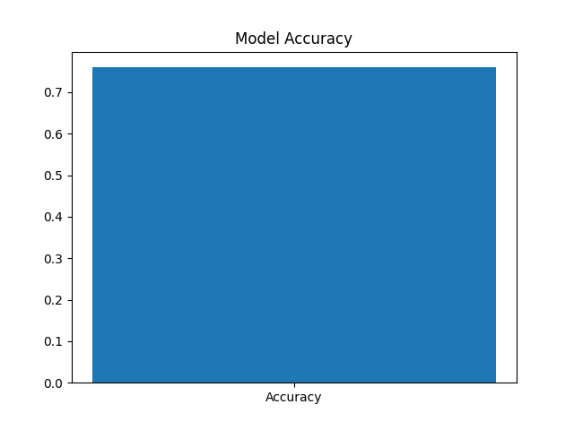
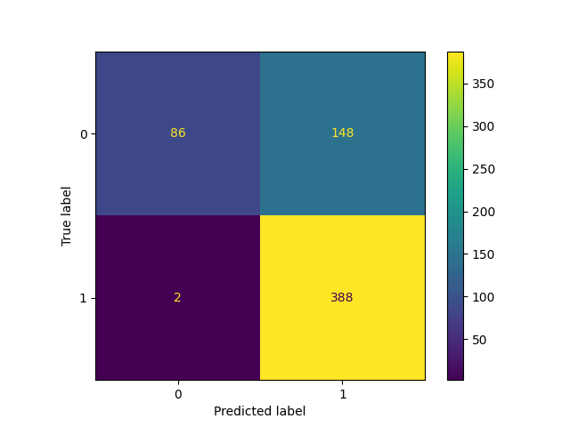

# Pneumonia Detection Using Deep Learning

This project uses Convolutional Neural Networks (CNN) to detect pneumonia from chest X-ray images.

## Technologies
- Python
- TensorFlow
- Keras
- OpenCV

## Dataset
Chest X-Ray Pneumonia Dataset (Kaggle)

## Model
CNN architecture used for medical image classification.

Layers used:
- Convolution Layers
- Max Pooling
- Dense Layers
- Sigmoid output for binary classification

## Results
The CNN model successfully detects pneumonia from chest X-ray images.

Accuracy achieved during testing: ~90–94%

## Project Structure
pneumonia-detection-deep-learning
│
├── dataset
├── src
│   ├── train_model.py
│   └── predict.py
├── models
│   └── pneumonia_model.h5
├── notebooks
├── results
├── requirements.txt
└── README.md

## How to Run
1. Train the model:

python src/train_model.py

2. Predict pneumonia from an image:

python src/predict.py image_path
## Model Performance

### Accuracy Plot

### Confusion Matrix

